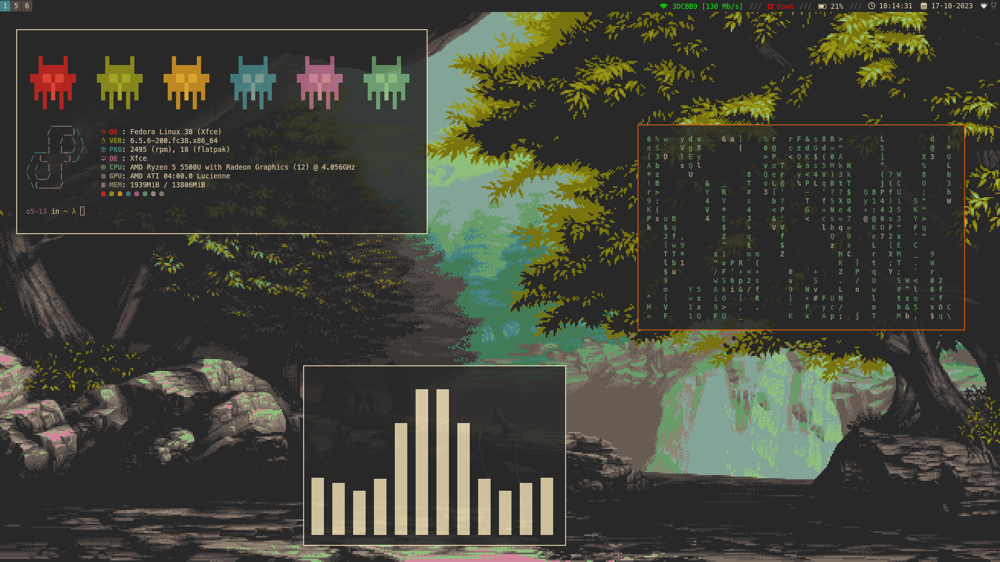
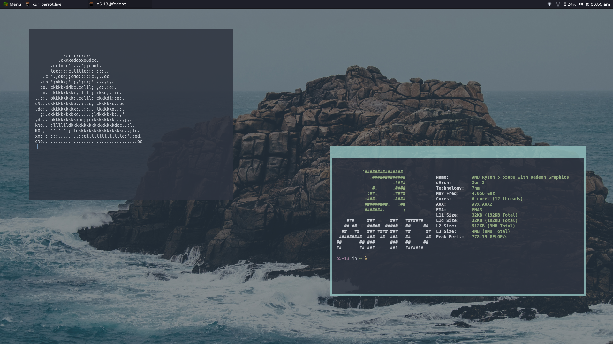

# Dotfile for Fedora 39

## XFCE + i3 w/ Gruvbox

## XFCE + herbstluftwm w/ Nord

## Specifications

- Shell: `zsh`
- Terminal: `kitty`
- Text editor: `Nvim`
- Browser: `firefox`
- Compositor: `picom`
- File manager: `Nemo`
- WMs: `i3`, `herbstluftwm`
