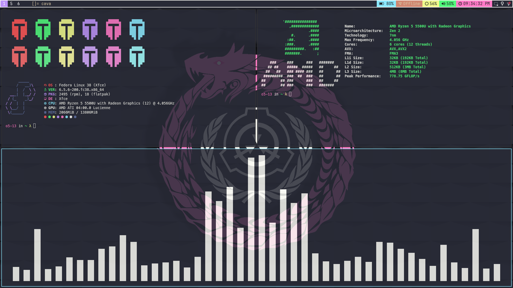

# Dotfile for Fedora 38 

## XFCE + bspwm w/ Dracula colorscheme

## XFCE + i3 w/ Gruvbox colorscheme

## XFCE + herbstluftwm w/ Nord colorscheme

## Specifications

- Distro: `Fedora XFCE 38`
- Shell: `zsh`
- Terminal: `kitty`
- Text editor: `Nvim`
- File manager: `Nemo`
- WMs: `i3`, `bspwm` or `herbstluftwm`
