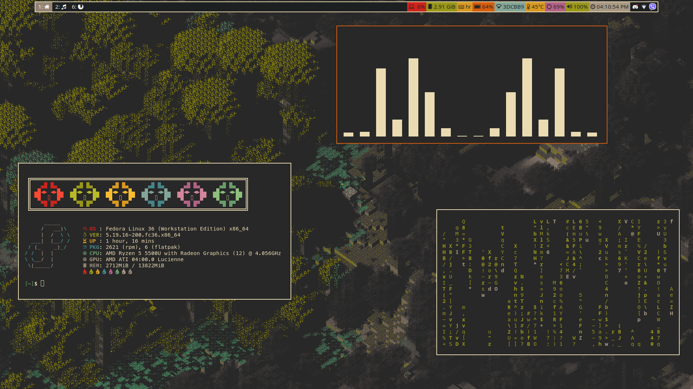
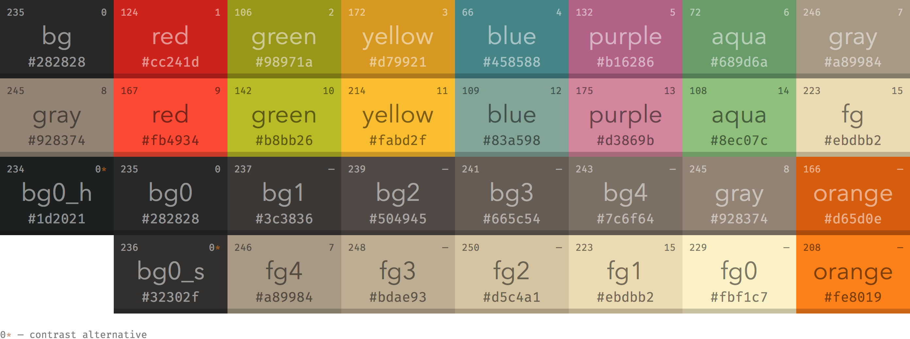
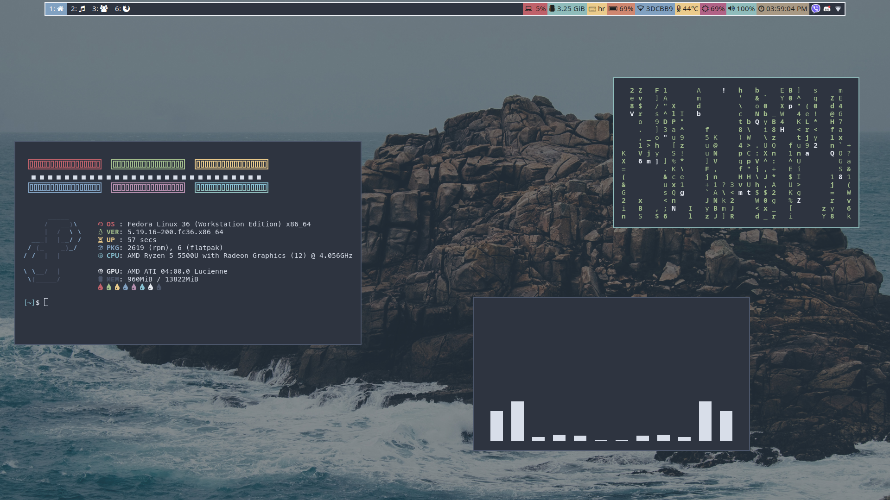
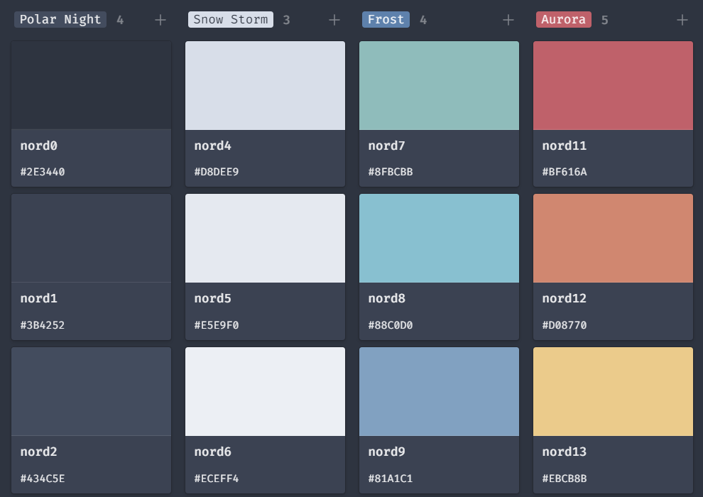

# Dotfile for Fedora Workstation 37

## Dracula Colorscheme

## Gruvbox Colorscheme

## Nord Colorscheme

## Specifications

- Distro: `Fedora Workstation 37`
- WM: `i3-gaps`
- Bar: `Polybar`
- Terminal: `kitty`
- Shell: `zsh 5.8.1`
- Text editor: `Vim`
- File manager: `Thunar`
- Terminal apps: `neofetch`, `cava`, `cmatrix`
